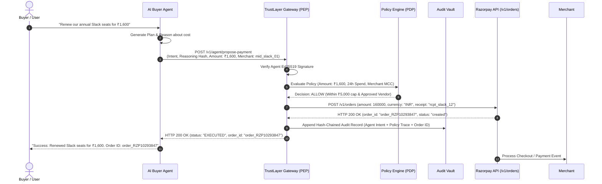

# 07 — Sequence Diagram: Autonomous Payment Allowed (Razorpay)

## Purpose

Demonstrates a successful autonomous checkout flow where an AI Buyer Agent places an order within pre-configured budget caps on Razorpay.

---

## Mermaid Sequence Diagram

