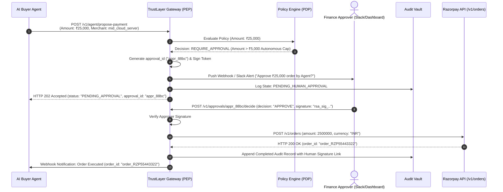

# 08 — Sequence Diagram: High-Value Step-Up Human Approval

## Purpose

Demonstrates how TrustLayer gates high-value transactions exceeding autonomous limits ($> ₹5,000$) and executes them on Razorpay only upon receiving signed human approval.

---

## Mermaid Sequence Diagram

