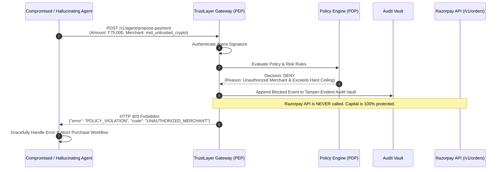

# 09 — Sequence Diagram: Hallucination / Rogue Payment Blocked

## Purpose

Demonstrates graceful failure handling where an AI agent hallucinates an amount, targets an unapproved merchant, or falls victim to prompt injection. TrustLayer intercepts and blocks the request before Razorpay APIs are ever touched.

---

## Mermaid Sequence Diagram

