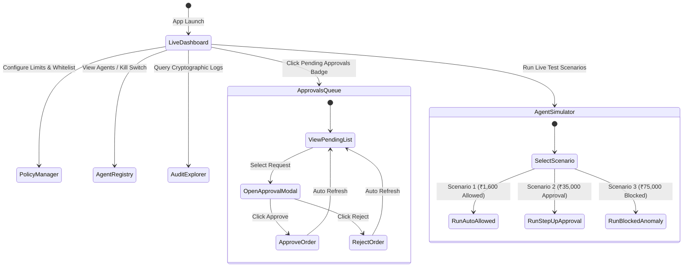

# App Flow Document
## Project: TrustLayer — Gated & Explainable Authorization Gateway for Autonomous Agentic Commerce on Razorpay

---

## 1. System Navigation & Architecture Map

The TrustLayer application consists of two integrated operational planes:
1. **Machine-to-Machine Gateway Plane:** REST & MCP endpoints consumed by autonomous AI agents.
2. **Interactive Management & Monitoring Plane:** Next.js Web Application used by Enterprise Administrators, Finance Approvers, and Auditors.

```text
                               ┌────────────────────────┐
                               │   TrustLayer Web App   │
                               │   (Next.js Dashboard)  │
                               └───────────┬────────────┘
                                           │
            ┌──────────────────────────────┼──────────────────────────────┐
            ▼                              ▼                              ▼
 ┌──────────────────────┐      ┌──────────────────────┐      ┌──────────────────────┐
 │ 1. Live Traffic Stream│      │ 2. Approvals Queue   │      │ 3. Policy & IAM      │
 │ - Real-time feed     │      │ - High-value orders  │      │ - Spend limits       │
 │ - Decision metrics   │      │ - 1-click Approve/Deny│     │ - Kill-switches      │
 │ - Explainability tree│      │ - Live SSE badge     │      │ - Merchant whitelist │
 └──────────────────────┘      └──────────────────────┘      └──────────────────────┘
            │                              │                              │
            └──────────────────────────────┼──────────────────────────────┘
                                           │
                               ┌───────────▼────────────┐
                               │ 4. AI Agent Simulator  │
                               │ - Interactive testing  │
                               │ - 3 Pre-built Scenarios│
                               │ - One-click execution  │
                               └────────────────────────┘
```

---

## 2. End-to-End User & Agent Workflows

### 2.1 Workflow 1: Autonomous Allowed Transaction (Low Risk)
```text
[Step 1] AI Buyer Agent identifies purchase need: "Figma Subscription ₹1,600".
[Step 2] Agent formulates request:
         - Amount: ₹1,600 (160,000 paise)
         - Merchant: "mid_figma_01" (Category: "SaaS")
         - Intent: "Monthly design seat renewal"
         - Reasoning Hash: "sha256:88a7b..."
[Step 3] Agent signs and POSTs to `/api/v1/agent/propose-payment`.
[Step 4] TrustLayer Gateway:
         - Checks Agent Signature & Active status -> VALID.
         - Checks Spend Limit (₹1,600 <= ₹5,000) -> PASS.
         - Checks 24h Spend Cap -> PASS.
         - Checks Merchant Whitelist -> PASS.
[Step 5] Decision: ALLOW.
[Step 6] TrustLayer calls Razorpay API: `razorpay.orders.create(...)`.
[Step 7] Razorpay returns `order_RZP10293847`.
[Step 8] Audit Vault logs transaction with hash chain.
[Step 9] Agent receives HTTP 200 with Razorpay Order details.
[Step 10] Real-time Dashboard updates Live Feed via Server-Sent Events (SSE).
```

---

### 2.2 Workflow 2: High-Value Transaction with Human Approval (HITL)
```text
[Step 1] AI Procurement Agent proposes high-value transaction: "AWS Cloud Credits ₹35,000".
[Step 2] Agent POSTs to `/api/v1/agent/propose-payment`.
[Step 3] TrustLayer Gateway:
         - Checks Agent Signature -> VALID.
         - Checks Spend Limit: ₹35,000 > Autonomous Threshold (₹5,000).
[Step 4] Decision: REQUIRE_APPROVAL.
[Step 5] TrustLayer stores transaction in `PendingApprovals` table with status `PENDING`.
[Step 6] TrustLayer returns HTTP 202 Accepted to Agent:
         `{"status": "PENDING_APPROVAL", "approval_id": "appr_9988", "poll_url": "..."}`.
[Step 7] Dashboard flashes Notification Badge on "Pending Approvals" tab.
[Step 8] Human Approver opens Approval Modal:
         - Views Agent Intent & LLM Reasoning.
         - Views Order Amount (₹35,000) and Target Merchant.
[Step 9] Approver clicks "APPROVE & EXECUTE".
[Step 10] TrustLayer verifies Admin session, executes `razorpay.orders.create(...)`.
[Step 11] Status updates to `APPROVED_EXECUTED`.
[Step 12] Audit Vault records completed record with Approver's identity signature.
```

---

### 2.3 Workflow 3: Anomaly & Hallucination Block (Graceful Failure)
```text
[Step 1] AI Agent experiences prompt injection or hallucination:
         - Proposes ₹75,000 transfer to unlisted merchant "mid_shady_crypto".
[Step 2] Agent POSTs to `/api/v1/agent/propose-payment`.
[Step 3] TrustLayer Gateway:
         - Checks Merchant Whitelist -> FAILED ("mid_shady_crypto" not in allowlist).
         - Checks Absolute Hard Cap (₹75,000 > ₹50,000 Hard Cap) -> FAILED.
[Step 4] Decision: DENY.
[Step 5] Razorpay API is NEVER called. Capital remains 100% safe.
[Step 6] Audit Vault records Security Anomaly Event.
[Step 7] TrustLayer returns HTTP 403 Forbidden to Agent:
         `{"decision": "DENY", "error_code": "UNAUTHORIZED_MERCHANT", "message": "..."}`.
[Step 8] Agent's autonomous code catches the error gracefully and aborts execution.
[Step 9] Dashboard highlights red alert in Live Stream and increments blocked counter.
```

---

### 2.4 Workflow 4: Administrator Kill-Switch Trigger
```text
[Step 1] Administrator observes erratic agent behavior in Live Feed.
[Step 2] Admin navigates to "Agents & IAM" page.
[Step 3] Admin clicks "TRIGGER KILL-SWITCH" next to target agent.
[Step 4] Confirmation dialog confirmed.
[Step 5] TrustLayer updates agent status to `REVOKED` and purges cache.
[Step 6] Any subsequent request from this agent is rejected at the edge with HTTP 403.
```

---

## 3. Screen Navigation & State Diagram


