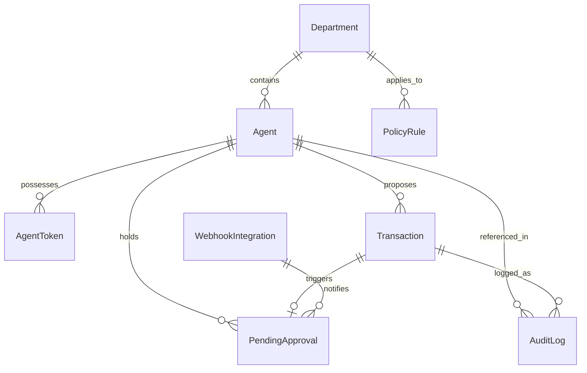

# Database Schema Specification — TrustLayer v0.2.2

**Document Version:** 0.2.2  
**Target:** Prisma 7 + PostgreSQL Schema & Migration Definitions  
**Status:** Approved Specification  

---

## 1. Entity-Relationship Data Model (ERD)



---

## 2. Complete Prisma 7 Schema (`prisma/schema.prisma`)

```prisma
datasource db {
  provider = "postgresql"
}

generator client {
  provider = "prisma-client-js"
}

// --------------------------------------------------------
// 1. Department & Organization Hierarchy
// --------------------------------------------------------
enum DepartmentRole {
  ENGINEERING
  MARKETING
  SALES
  OPERATIONS
  EXECUTIVE
  GENERAL
}

model Department {
  id          String         @id @default(cuid())
  code        DepartmentRole @unique
  name        String         // e.g. "Engineering & Infrastructure"
  description String?
  agents      Agent[]
  policies    PolicyRule[]
  createdAt   DateTime       @default(now())
  updatedAt   DateTime       @updatedAt
}

// --------------------------------------------------------
// 2. Agent IAM & Cryptographic Credentials
// --------------------------------------------------------
enum AgentStatus {
  ACTIVE
  SUSPENDED
  REVOKED
}

model Agent {
  id              String            @id @default(cuid())
  agentId         String            @unique // e.g. "agent_procure_v2"
  name            String
  description     String?
  publicKey       String            // Ed25519 Public Key (Hex)
  status          AgentStatus       @default(ACTIVE)
  role            String            @default("BUYER_AGENT")
  ownerEmail      String
  departmentId    String?
  department      Department?       @relation(fields: [departmentId], references: [id])
  
  // Financial Caps (in Paise)
  maxPerOrderCap  Int               @default(500000)   // ₹5,000 auto-allow limit
  dailySpendCap   Int               @default(2000000)  // ₹20,000 daily velocity limit
  monthlyBudgetCap Int              @default(10000000) // ₹1,00,000 monthly limit
  totalSpentPaise BigInt            @default(0)
  
  // Relations
  tokens          AgentToken[]
  transactions    Transaction[]
  pendingApprovals PendingApproval[]
  auditLogs       AuditLog[]
  
  createdAt       DateTime          @default(now())
  updatedAt       DateTime          @updatedAt
}

model AgentToken {
  id          String    @id @default(cuid())
  agentId     String
  agent       Agent     @relation(fields: [agentId], references: [id], onDelete: Cascade)
  tokenPrefix String    // e.g. "tl_live_sec_..."
  tokenHash   String    // SHA-256 hash of full token
  name        String    // e.g. "Production Claude Desktop Token"
  expiresAt   DateTime?
  lastUsedAt  DateTime?
  createdAt   DateTime  @default(now())
}

// --------------------------------------------------------
// 3. Multi-Tier Hierarchical Spend Policies
// --------------------------------------------------------
model PolicyRule {
  id                   String      @id @default(cuid())
  name                 String      @unique // e.g. "GlobalEnterpriseSaaSPolicy"
  description          String?
  isActive             Boolean     @default(true)
  departmentId         String?
  department           Department? @relation(fields: [departmentId], references: [id])
  
  // Multi-Tier Spend Thresholds (Paise)
  tier1MaxOrderPaise   Int         @default(500000)   // Tier 1: Auto-Allow (<= ₹5,000)
  tier2ThresholdPaise  Int         @default(2500000)  // Tier 2: Single Manager (<= ₹25,000)
  tier3ThresholdPaise  Int         @default(10000000) // Tier 3: Dual-Custody (<= ₹1,00,000)
  hardCeilingPaise     Int         @default(10000000) // Tier 4: Hard Deny (> ₹1,00,000)
  dailySpendLimitPaise Int         @default(2000000)  // Rolling 24h limit (₹20,000)
  
  // Whitelists & Blocklists
  allowedCurrencies    String[]    @default(["INR"])
  allowedMccs          String[]    @default(["5734", "7372", "4816", "7011", "4511"])
  blockedMccs          String[]    @default(["6051", "7995", "4829"])
  allowedMerchants     String[]    @default(["mid_slack_01", "mid_figma_01", "mid_aws_01", "mid_github_01", "mid_cloudflare_01"])
  
  // Temporal Guardrails (Working Hours)
  enforceWorkingHours  Boolean     @default(false)
  workingDays          String[]    @default(["MON", "TUE", "WED", "THU", "FRI"])
  startHourUtc         Int         @default(3)        // 08:30 AM IST (03:00 UTC)
  endHourUtc           Int         @default(14)       // 07:30 PM IST (14:00 UTC)
  
  // Risk Scoring Sensitivity
  riskScoreThreshold   Float       @default(0.35)
  
  createdAt            DateTime    @default(now())
  updatedAt            DateTime    @updatedAt
}

// --------------------------------------------------------
// 4. Transaction Proposals & Real-Time Ledger
// --------------------------------------------------------
enum DecisionType {
  ALLOW
  REQUIRE_APPROVAL
  DENY
}

enum TransactionStatus {
  PENDING
  EXECUTED
  BLOCKED
  REJECTED
  FAILED
}

model Transaction {
  id                 String             @id @default(cuid())
  agentId            String
  agent              Agent              @relation(fields: [agentId], references: [agentId])
  amountPaise        Int
  currency           String             @default("INR")
  merchantId         String
  merchantCategory   String?
  mccCode            String?
  intent             String             // Declared agent purchase goal
  reasoningHash      String             // SHA-256 hash of agent reasoning
  reasoningText      String?            // LLM explainability reasoning
  decision           DecisionType
  decisionReason     String
  razorpayOrderId    String?
  status             TransactionStatus
  riskScore          Float              @default(0.0)
  rawRequestPayload  Json
  rawResponsePayload Json
  
  pendingApproval    PendingApproval?
  auditLogs          AuditLog[]
  
  createdAt          DateTime           @default(now())
  updatedAt          DateTime           @updatedAt
}

// --------------------------------------------------------
// 5. Dual-Custody Pending Approvals Queue
// --------------------------------------------------------
enum ApprovalStatus {
  PENDING
  APPROVED
  REJECTED
  EXPIRED
}

enum ApprovalTier {
  TIER_SINGLE_MANAGER
  TIER_DUAL_CUSTODY
}

model PendingApproval {
  id                 String         @id @default(cuid())
  transactionId      String         @unique
  transaction        Transaction    @relation(fields: [transactionId], references: [id])
  agentId            String
  agent              Agent          @relation(fields: [agentId], references: [agentId])
  amountPaise        Int
  currency           String
  merchantId         String
  tier               ApprovalTier   @default(TIER_SINGLE_MANAGER)
  status             ApprovalStatus @default(PENDING)
  
  // Primary Approver (Manager)
  approverEmail      String?
  approverSignature  String?
  
  // Secondary Approver (for Dual-Custody Tier 3)
  secondApproverEmail String?
  secondApproverSig  String?
  
  decisionNotes      String?
  expiresAt          DateTime
  resolvedAt         DateTime?
  createdAt          DateTime       @default(now())
  updatedAt          DateTime       @updatedAt
}

// --------------------------------------------------------
// 6. Cryptographic Tamper-Evident Audit Ledger
// --------------------------------------------------------
model AuditLog {
  id                   String       @id @default(cuid())
  logIndex             Int          @unique
  transactionId        String
  transaction          Transaction  @relation(fields: [transactionId], references: [id])
  agentId              String
  agent                Agent        @relation(fields: [agentId], references: [agentId])
  amountPaise          Int
  decision             DecisionType
  intent               String
  reasoningHash        String
  policyEvaluationJson Json
  previousLogHash      String       // SHA-256 of block (n-1)
  currentLogHash       String       // SHA-256(prevHash | index | txnId | decision | payload)
  timestamp            DateTime     @default(now())
}

// --------------------------------------------------------
// 7. Omnichannel Webhook Integrations
// --------------------------------------------------------
enum WebhookChannel {
  TELEGRAM
  WHATSAPP
  SLACK
  CUSTOM_HTTP
}

model WebhookIntegration {
  id          String         @id @default(cuid())
  channel     WebhookChannel
  name        String         // e.g. "Finance Telegram Approval Bot"
  webhookUrl  String
  channelId   String?        // Telegram Chat ID / Slack Channel ID
  secretToken String?        // For HMAC callback verification
  isActive    Boolean        @default(true)
  createdAt   DateTime       @default(now())
  updatedAt   DateTime       @updatedAt
}
```
